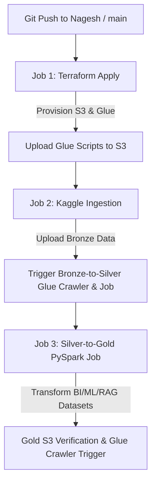

# Knowledge Transfer (KT) Document: CI/CD & Automation Pipeline Setup

## Executive Summary
This document serves as a Knowledge Transfer (KT) guide for the **CDAC BDA Group 06 Yelp Big Data** automation pipeline. It details the complete architecture, configuration steps, exact fixes applied, and operational instructions for managing the GitHub Actions CI/CD workflows and HCP Terraform infrastructure.

---

## 1. Key Changes & Technical Fixes Made

### A. Repository Directory Relocation
- **Original Location**: `.github/workflows/` was nested inside `automation/.github/workflows/`.
- **Issue**: GitHub Actions **only** parses workflow definitions located at the root directory (`.github/workflows/`). Workflows in subdirectories are completely ignored by GitHub's runner system.
- **Fix**: Moved `.github/workflows/` to the repository root directory (`.github/workflows/`).

### B. Relative Path Corrections (`defaults.run.working-directory`)
- **Issue**: Moving `.github/workflows/` to root meant all GitHub Actions runner steps executed from the repo root directory (`/`). Steps referencing `infra/`, `ingestion/requirements.txt`, or `glue/scripts/` threw `No such file or directory` errors.
- **Fix**:
  - Set `defaults.run.working-directory: ./automation/infra` for Terraform jobs.
  - Set `defaults.run.working-directory: ./automation` for Python/Kaggle ingestion and PySpark ETL jobs.
  - Updated S3 Glue script upload path to `automation/glue/scripts/*.py`.

### C. Single Workflow Execution Control (`concurrency`)
- **Issue**: When pushing changes to a branch with an open Pull Request, both `Deploy & Ingest Pipeline` and `Terraform Plan (PR Check)` ran in parallel, causing race conditions and resource locks.
- **Fix**: Added concurrency groups to all workflow files:
  ```yaml
  concurrency:
    group: ${{ github.workflow }}-${{ github.ref }}
    cancel-in-progress: true
  ```
  This ensures only **one workflow run** executes per branch at any given time.

### D. HCP Terraform Workspace & Secret Integration
- **HCP Workspace**: Connected `cdac-bda-group06` organization workspace `main-yelp-bigdata-workspace`.
- **HCP Variables**: Configured AWS credentials (`AWS_ACCESS_KEY_ID`, `AWS_SECRET_ACCESS_KEY`, `AWS_SESSION_TOKEN`, `AWS_DEFAULT_REGION`) under workspace environment variables (`env`).
- **GitHub Repository Secrets**: Added `TF_API_TOKEN` alongside Kaggle and AWS credentials.

---

## 2. Secrets & Configuration Matrix

### GitHub Repository Secrets (`Settings -> Secrets and variables -> Actions`)
| Secret Name | Purpose |
| :--- | :--- |
| `TF_API_TOKEN` | User API token generated from HCP Terraform for CLI authentication |
| `AWS_ACCESS_KEY_ID` | AWS Access Key |
| `AWS_SECRET_ACCESS_KEY` | AWS Secret Access Key |
| `AWS_SESSION_TOKEN` | AWS Session Token (for temporary IAM/Learner Lab credentials) |
| `KAGGLE_USERNAME` | Kaggle API Username for dataset download |
| `KAGGLE_KEY` | Kaggle API Token key |

---

## 3. Workflow File Specifications

| Workflow File | Trigger Events | Purpose & Working Dir |
| :--- | :--- | :--- |
| [terraform-apply.yml](file:///.github/workflows/terraform-apply.yml) | `push` (main, Nagesh), `workflow_dispatch` | Full end-to-end deployment: Terraform Apply $\rightarrow$ Ingest Kaggle $\rightarrow$ Run Glue ETL |
| [terraform-plan.yml](file:///.github/workflows/terraform-plan.yml) | `pull_request` (main), `workflow_dispatch` | Pull Request validation (`working-directory: ./automation/infra`) |
| [run-gold-etl.yml](file:///.github/workflows/run-gold-etl.yml) | `workflow_dispatch` | Manual execution trigger for PySpark Silver-to-Gold job (`working-directory: ./automation`) |
| [terraform-destroy.yml](file:///.github/workflows/terraform-destroy.yml) | `workflow_dispatch` | Manual teardown of AWS infrastructure |

---

## 4. Pipeline Execution Sequence (`terraform-apply.yml`)



---

## 5. Maintenance & Troubleshooting Checklist for Team Members

1. **Changing HCP Terraform Workspace Name**:
   - If a new workspace is created in HCP Terraform, update `name` in [backend.tf](file:///automation/infra/backend.tf):
     ```hcl
     workspaces {
       name = "YOUR_NEW_WORKSPACE_NAME"
     }
     ```

2. **Expired AWS Session Tokens**:
   - If using AWS Academy / Learner Lab, credentials expire after 4 hours. Update `AWS_ACCESS_KEY_ID`, `AWS_SECRET_ACCESS_KEY`, and `AWS_SESSION_TOKEN` in GitHub Secrets and HCP Terraform workspace variables.

3. **Re-running a Failed Workflow**:
   - Go to [GitHub Actions Tab](https://github.com/CDAC-BDA-Group-06/Yelp_Big_Data-Feb-2026/actions), select **Deploy & Ingest Pipeline**, click **Re-run all jobs**.
