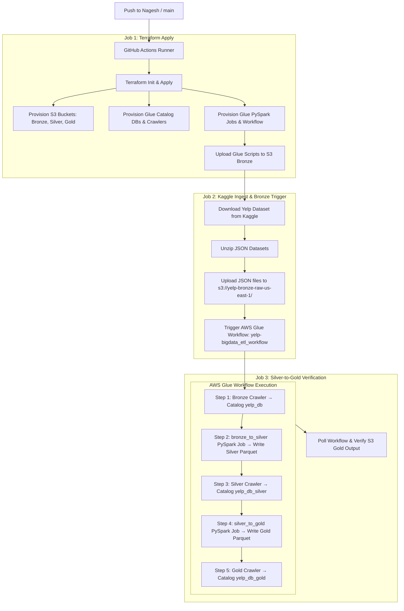

# Yelp Big Data Lakehouse — Architecture & Setup Guide

## 1. Executive Summary
This document provides a clear, step-by-step technical guide for the **Yelp Big Data Medallion Architecture Lakehouse** pipeline. The system automates infrastructure provisioning, raw Kaggle dataset ingestion, Bronze-to-Silver ETL, and Silver-to-Gold analytics transformation using Terraform, AWS Glue, PySpark, and GitHub Actions.

---

## 2. Directory Layout & Organization

The project is structured under the `automation/` folder for clean separation of pipeline concerns:

```text
Yelp_Big_Data-Feb-2026/
├── .github/workflows/         # GitHub Actions Workflow Definitions
│   ├── terraform-apply.yml    # Main Deploy & Ingest Pipeline
│   ├── terraform-plan.yml     # Pull Request validation workflow
│   ├── terraform-destroy.yml  # On-demand environment destruction
│   └── run-gold-etl.yml       # Manual Silver-to-Gold ETL trigger
└── automation/                # Core Automation Codebase
    ├── infra/                 # Infrastructure as Code (Terraform)
    │   ├── backend.tf         # HCP Terraform Cloud remote backend
    │   ├── main.tf            # Module invocations (S3, Glue)
    │   ├── provider.tf        # AWS Provider configuration
    │   ├── terraform.tfvars   # Input variable values
    │   ├── variables.tf       # Infrastructure input definitions
    │   ├── outputs.tf         # S3 Bucket & Glue Resource outputs
    │   └── modules/           # Reusable Terraform Modules (s3, glue)
    ├── glue/scripts/          # PySpark Transformation Scripts
    │   ├── bronze_to_silver.py# Clean JSON → Flattened Snappy Parquet
    │   └── silver_to_gold.py  # BI Star Schema + ML Features + RAG Vectors
    ├── ingestion/             # Ingestion & Glue Workflow Triggers
    │   ├── ingest.py          # Kaggle download, S3 upload, Glue trigger
    │   ├── trigger_gold.py    # Glue Workflow polling & Gold trigger
    │   └── requirements.txt   # Ingestion Python dependencies
    └── docs/                  # Architecture & KT Documentation
        ├── setup_guide.md     # This comprehensive guide
        └── architecture.md    # Medallion Lakehouse specification
```

---

## 3. Step-by-Step Pipeline Execution Flow



---

## 4. Medallion Layers & Schema Overview

| Layer | Storage Path | Format | Glue Catalog DB | Description |
|---|---|---|---|---|
| **Bronze** | `s3://yelp-bronze-raw-us-east-1/` | Raw JSON | `yelp_db` | Raw exports of Kaggle Yelp dataset (`business`, `review`, `user`, `checkin`, `tip`, `photos`). |
| **Silver** | `s3://yelp-silver-clean-us-east-1/silver/` | Parquet (Snappy) | `yelp_db_silver` | Cleaned, un-nested struct attributes, sanitized columns, deduplicated primary keys. |
| **Gold** | `s3://yelp-gold-analytics-us-east-1/gold/` | Parquet (Snappy) | `yelp_db_gold` | Production-ready analytics tables partitioned for BI, ML Feature Store, and RAG. |

---

## 5. Required GitHub Secrets & Environment Setup

To run the pipeline in GitHub Actions, set the following **Repository Secrets** under **Settings $\rightarrow$ Secrets and variables $\rightarrow$ Actions**:

1. **`AWS_ACCESS_KEY_ID`**: Your active AWS IAM Access Key.
2. **`AWS_SECRET_ACCESS_KEY`**: Your active AWS IAM Secret Access Key.
3. **`AWS_SESSION_TOKEN`**: AWS Academy temporary session token.
4. **`TF_API_TOKEN`**: HCP Terraform User API Token.
5. **`KAGGLE_USERNAME`**: Your Kaggle account username.
6. **`KAGGLE_KEY`**: Your Kaggle API key.

---

## 6. Troubleshooting & Gotchas

- **AWS Academy Token Expiration**: AWS Academy session tokens expire after 4 hours. Update `AWS_ACCESS_KEY_ID`, `AWS_SECRET_ACCESS_KEY`, and `AWS_SESSION_TOKEN` in GitHub Secrets when expired.
- **S3 Restricted Resources**: AWS Academy `LabRole` denies `s3:GetBucketPublicAccessBlock` and `s3:GetEncryptionConfiguration`. S3 bucket encryption and access blocking are managed by AWS default account policies.
- **Glue Triggers**: All Glue triggers in `infra/modules/glue/main.tf` have `start_on_creation = true` so AWS Glue activates them upon provisioning.
